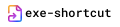

<p align="center">
  
</p>

<p align="center">
  A small Rust project to launch an executable.
</p>

## Usage

1. Create a `config.toml` file with the following structure:
    ```toml
    target = "/tmp/shorty/main"
    start_in = "/tmp/shorty"
    arguments = ["-t", "Hello, World!"]
    ```
2. Run the program:

    `cargo run -- [path-to-config.toml]`

    > **_NOTE:_** If no path is provided, the program will look for a .toml file with the same name as the executable.

    
## Contributing

Contributions to `exe-shortcut` are welcome! Please open an issue or submit a pull request on the GitHub repository.

## License

`exe-shortcut` is released under the [Unlicense](LICENSE.md). This means the code is in the public domain, and you can use, modify, and distribute it without any restrictions. For more information, please see the [Unlicense website](https://unlicense.org/).